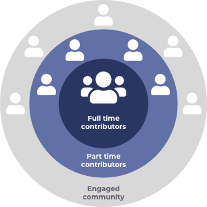

# Overview

Cardano contributors are community members who are paid by the Cardano treasury to work full time to help support, improve and maintain the Cardano ecosystem. Contributors choose a role they want to support and then if voted on by the community will get funded directly from the treasury.&#x20;

Contributors help in a multitude of areas including working on infrastructure and tooling, supporting the community, improving processes or even supporting other projects in the ecosystem.&#x20;

The main areas for Cardano contributors to support include the developer ecosystem to make it easy for developers to build on Cardano and help bring more alignment in creation and maintenance of the tools, libraries and SDKs that are available. Secondly contributors will also help support the stake pool operators in making it as easy as possible to run a Cardano node.

### Contents

* [**Contributor**](broken-reference) - Find out about what would be expected from a Cardano contributor.
* ****[**Contributor Guides**](broken-reference) - Guides on how to create a proposal as a contributor candidate and also how to assess candidate proposals.
* [**Stewardship & Delegated Authority**](broken-reference) - Exploring a plan for how Cardano contributors can be an effective solution for passing ownership and authority over to the community for certain areas of the ecosystem.
* ****[**Treasury**](broken-reference) - Details of how full time contributors would manage a Cardano contributor treasury that would be used for rapid funding that supports the ecosystem.
