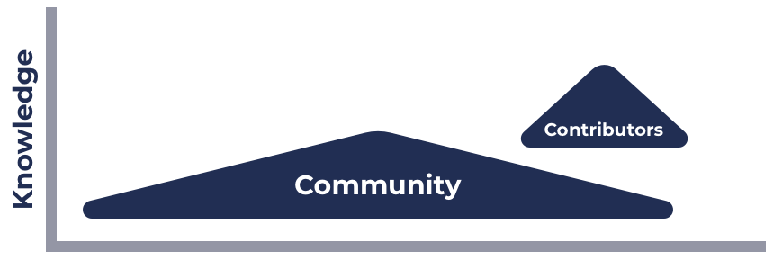

# Product Development Workflow

### **Product development workflow**

1. **Problem sensing** - Gather problems about the ecosystem that community members are experiencing. Problem sensing should always be happening.
2. **Problem categorisation** - The problems should be categorised such as is it a technical problem? A process issue? Lack of certain functionality? Similar problems should be combined if they are a duplicate of an existing problem.
3. **Problem details and context** - What added details are needed to understand the problem, are their reasons it exists and hasn't been solved? Is there other contexts to consider such as another solution already being implemented that will impact this problem?&#x20;
4. **Vote on problem prioritisation** - With knowledge of all the current ecosystem problems which are the biggest priority to resolve?
5. **Suggest solutions** - For any of the problems a solution approach can be suggested that's worth considering.
6. **Solution details and context** - What is the difficulty of integrating each of the solutions? How long would it take? Are there other considerations to make or potential knock on effects?
7. **Vote on solution** - For a given problem one of the potential solutions can be voted on to decide which one will be implemented.
8. **Draft implementation plan** - Voted on solutions can have a draft plan detailed out for how it will be implemented, this could the complete set of tasks to complete and any data that will be recorded to measure the success. This information should be public to allow anyone to provide feedback wherever necessary.
9. **Execute initial implementation** - An initial implementation can be executed based off the voted on solution and any plans made.
10. **Gather feedback** - The end user for that solution can provide feedback on the effectiveness of that solution along with if there are any areas for improvement.
11. **Analyse success metric data** - Data recorded to measure the success can be analysed to see if the solution has had the correct impact.
12. **Iterate solution** - Using the feedback provided and any success metric data the solution can be improved where necessary in a new iterated solution. The feedback, data analysis and iteration steps can be repeated as many times as needed.

****

**Notes**

* **Collaboration** - Collaboration between multiple people is needed for every step of a product development process. Strong collaboration requires open, transparent and frequent communication from those involved in the process.&#x20;
* **Consensus** - Voting on problem prioritisation and solutions require a democratic voting process with participants who have enough knowledge of the ecosystem.&#x20;
* **Open process** - The information and decisions made from each part of the process should be open to the community. Feedback should be possible at any given stage.

### Catalyst ecosystem knowledge differences

By Cardano ecosystem knowledge we are referring to understanding the core processes and tools used within the Cardano ecosystem such as being a community advisor or how the voting app works.

* Community **** members are anyone who interacts with the Catalyst ecosystem.
* Contributors includes anyone who is making contributions to support, improve or maintain the ecosystem. Contributors are community members, however for the visual aid they have been presented separately.
* The size of the community population is higher than the contributors (roughly represented by the sizes of the shapes above).
* The knowledge in each population is represented by the triangle. The tip of the triangle represents the smaller number of people who have a high knowledge of the ecosystem. A larger base of those populations is represented by the wider base of the shape who have a lower amount of knowledge.
* Some community members can have a higher knowledge than passive contributors.
* Active contributors that make changes to the ecosystem should have the highest knowledge of the ecosystem as they will always be involved in the technical planning, decisions and implementation of core ecosystem components.

The exact knowledge of each member in the community or contributor population is not important, nor is visualising the exact shape needed to represent those populations. The important thing to note is there are knowledge differences for both populations ranging from low too high. Active contributors should for the most part have the highest knowledge of the core ecosystem.

**Impact of knowledge on feedback**

* In some cases it doesn't matter how much knowledge someone has. Problem sensing, suggesting solutions and giving feedback on solutions are all examples where the feedback is valued from all participants regardless of knowledge.
* For some cases the knowledge does have an impact on the usefulness of feedback. Problem prioritisation, drafting an implementation plan, or voting on a solution are all examples of where the participant should have sufficient knowledge of the ecosystem to provide an informed judgement.

**Impact of knowledge on governance**

* Governance in some areas should require no background knowledge in the ecosystem. Governance on general direction of the protocol or whether certain new projects should be funded or not are examples where the entire community is involved in governance.
* When governance becomes more specific and granular the knowledge of the participants involved becomes more important. When voting on prioritising problems or a solution approach the participants will need to have knowledge of the topic at hand to make an informed decision. On a more specific level areas such as technical decisions or planning for a chosen solution approach would need a higher level of relevant knowledge.

**Summary**

* Knowledge about the ecosystem can impact where feedback is as useful from the community. Trying to gather feedback from a large audience in scenarios where knowledge is required to make a well formed opinion would make the product development workflow less efficient and also potentially lead to worse outcomes.
* Knowledge about the ecosystem impacts the application of governance. For larger more significant changes a larger percentage and majority of the community should be involved in voting. For very specific changes such as technical implementation details the governance should be pushed towards more relevant participants who have the required knowledge.
