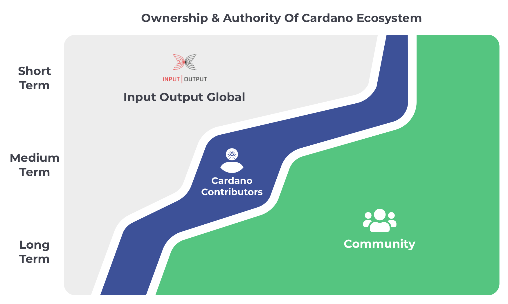

# Ownership & Authority Plan

There are a number of different ways in which ownership and authority can be passed over to the community. Analysis on this topic area highlighted how a cohort of individuals would be a simple and effective model to achieve this.

Electing a number of individuals offers a simple approach to passing over ownership and authority to the community. The model can contract and expand as required to support and improve the Cardano ecosystem.

A safe and incremental plan is needed to outline how the ownership and authority can be passed over to Cardano contributors with a rough plan of which systems and processes are involved. These suggestions are not fixed and are merely ideas for how ownership and authority can be incrementally passed over to the community.

### Scope

Cardano contributors would not receive any ownership and authority of important Cardano parameters or processes. IOG already have a large established development team that is working on passing over ownership and authority of core parameters and processes directly to the community.

Instead the scope of Cardano contributors in regards to ownership and authority is to focus on being a functional group of community members that help to support the community and contribute towards the improvement of the Cardano developer ecosystem and any improvements to running a stake pool node. Full time contributors are also suited to becoming a supportive structure for the communication channels used in the ecosystem as well as moderation of the CIP process by helping improve the suggestions made, increase collaboration between teams and moderate content from actors with malicious intent.

Over the long term and as the developer ecosystem and stake pool node operation infrastructure matures the role of Cardano contributors would reduce. Exploration would continue on the benefits of having either full time or part time contributors for the Cardano ecosystem that help with collaboration, moderation, oversight and support of processes and systems within the ecosystem that help it effectively function.

## Short term

**Theme**

Support, organise and learn

**How is ownership and authority changing?**

* Input Output Global - IOG retains all ownership and authority over changes to the Cardano blockchain as it does currently and continues to respond to CIP process suggestions from the community.
* Cardano Contributors - Cardano contributors begin to support the Cardano ecosystem in areas around documentation, education, events, moderation and problem sensing to help support and collaborate with the community.
* Community - The community has the same ownership and authority as they currently do and is only passed over more control as and when it is ready from IOG.

### Relevant systems and processes

**Documentation**

Documentation on how to run a stake pool node or develop on Cardano are vitally important for increasing the speed of adoption and shared understanding in the community. Cardano contributors are a good option for IOG to pass over control of some of these efforts to the community with a cohort of contributors who are focussed on bringing together and creating high quality documentation about the Cardano ecosystem.

**Education & training**

Any videos, podcasts or educational materials made by the community or Cardano contributors can be aggregated together and be showcased to the community to help new developers or stake pool operators learn about the ecosystem. Cardano contributors are well suited to supporting developers and stake pool operators with workshops and one to ones to find out pain points and answer questions. The more this is handled by the community the more that feedback can be fed back into improving the education and training that is made available. Cardano contributors could also help with translation support on key resources to increase the ease of access for international community members.

**Events & calendar management**

Cardano contributors can start to facilitate events and gatherings that bring the community together on important topics such as development on Cardano, scaling, best practices, standards or introductory events for newcomers. Managing a calendar for these events as well will help the community easily find and attend relevant discussions for them. Contributors supporting these environments can help promote a collaborative, educational and welcoming culture in the Cardano ecosystem.

**Moderation and community support**

Existing chat channels used to support Cardano developers such as in Discord, Slack or Telegram regularly need moderation and support. Cardano contributors could support in this process by helping to remove bad actors and also answer questions to support the wider community.

**Problem sensing**

Conversations with the community online, in events and in forums will be effective for Cardano contributors to identify pain points people are facing in the developer ecosystem and whilst running a stake pool node. These problems can be prioritised and explored for how they could be solved.

## Medium term

**Theme**

Build, iterate and analyse

**How is ownership and authority changing?**

* Input Output Global - IOG retains all ownership and authority over changes to the Cardano blockchain as it does currently. Some of the moderation and support for the CIP process could be passed over to Cardano contributors if this is suitable as well as authority to moderate certain communication channels.
* Cardano Contributors - Contributors help to support any CIP process suggestions and support where possible any improvements to the Cardano developer ecosystem or improvements to node operation. Contributors start to manage their own treasury to help speed up these development and support efforts and also start exploring how identity and reputation can be introduced to the developer and SPO community.
* Community - The community receive increasing support and collaboration from Cardano contributors in the ecosystem but still have the increasing authority and ownership that IOG is passing over to the community.

### Relevant system and processes

**CIP process suggestions**

With continuous cohorts of Cardano contributors elected the contributors involved will have an increasing understanding of what is happening in the Cardano ecosystem and what problems exist. This knowledge makes contributors well suited to potentially suggesting improvements to the Cardano blockchain based on the problems identified. These suggestions will likely come with collaboration with existing projects. Contributors could also look to support existing ideas in the community and connect them with relevant projects for discussion or could bring the relevant information to improve the quality and shared understanding of the implications involved with that proposal.

**Execute product development workflow**

Once problems are prioritised in the ecosystem Cardano contributors could help with the development of scripts, libraries and SDKs that solve some of the issues faced by developers in the ecosystem or by stake pool operators. Alternatively much of this work could also be executed by the community where the contributors can support their efforts with collaboration, making connections, technical support or even helping them secure funding to support their efforts.

**Cardano focussed treasury**

Cardano contributors are well suited to handling a treasury that is focussed specifically on supporting the Cardano ecosystem for the developer ecosystem or improving stake pool operation. These funds can help with supporting community members that are helping in these areas whether that’s educational support or development of new scripts, tools and libraries.

**Cardano identity & reputation**

Cardano contributors can be issued credentials to indicate that they are full time contributors that have been elected to support the Cardano ecosystem. This credential can be a way for the community to verify that someone in the community is a contributor who is able to support and help their development understanding and efforts. Cardano contributors is a good starting point for an identity and reputation system where community members who make valuable contributions to the ecosystem could also be issued credentials by Cardano contributors to showcase the value they have provided. Exploring ideas in this area around identity could provide ways for the community to build up a reputation for their efforts and knowledge in the Cardano ecosystem.

### Long term

**Theme**

Optimise, automate and scale

**How is ownership and authority changing?**

* Input Output Global - IOG start to handle passing over control of the parameters for Cardano over to the community and set up all the right incentives, mechanisms and knowledge for this to happen.
* Cardano Contributors - Contributors support the creation and moderation of the incentives, mechanisms and knowledge required for the community to handle the parameters of the blockchain. Efforts are made to automate this process where possible to reduce the need for full time contributors to support these important processes.
* Community - The community is able to participate and take authority and ownership of the parameters involved in the ecosystem and vote on any suggestions for improvements to the blockchain.

### Relevant systems and processes

**Cardano paramaters**

The community will eventually be making important parameter changes to the Cardano blockchain through governance votes. The parameters can have large implications on the operation of the blockchain and how it functions. Due to this importance it is vital that when these votes occur the right information and research has been conducted to inform the voters on what outcomes may occur. Cardano contributors could be an effective solution for these efforts as they would be paid full time to understand and collaborate in the Cardano ecosystem. The accrued knowledge from these contributions make them suitable to moderate and support the aggregation of information that is needed to understand a suggested parameter change before voting decisions are made.

**Cardano upgrade development & policies**

Support is needed in defining and maintaining policies that protect and improve any Cardano upgrade process. Cardano contributors over the long term could be effective for bringing together the community around efforts to assess upgrade proposals and audit implementations to ensure that policies are being followed that ultimately ensure the safety of the network. Due to the complexity of this task there could be long term value in having full time contributors supporting operation in this area. These efforts could also function with other incentive mechanisms. The importance of having highly qualified effort in supporting this area cannot be understated. Contributions towards the moderation and execution of the upgrade processes would likely have a very large impact on the operation of the Cardano blockchain.
